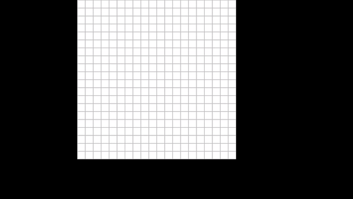

# Path Finding Visualization
## About ##
A visualization tool to better understand the popular path finding algorithms such as A* (A-Star), Dijkstra, Breadth First Search or Depth First Search. Currenlty only looking for the neighbors to the left, right, top and bottom for simplicity. 

## Demo (A* Algorithm) ##
See the links under acknowledgement section for detail explaination for this algorithm

## Setup and Requirements ##
1. Python 3.6
2. Pygame
3. Mouse (Map desgin is currently depended on 3 different mouse clicks)

## Usage ##
1. Run the program, and create a maze with left mouse click
2. Create a start node with center (scroll) click
3. Create an end node with right mouse click
4. Press space to see next available neighbor, and f cost of each neighbor to reach the end node
5. (Optional) - Do hand calculations to see how the f cost for each node (distance from the start node + distance to the end node) is calculated
6. Repeat step 4 (as per your own pace), until the path is found

## Acknowledgement ## 
1. Tech With Tim: https://www.youtube.com/watch?v=JtiK0DOeI4A 
2. Sebastian Lague: https://www.youtube.com/watch?v=-L-WgKMFuhE&t=3s 
